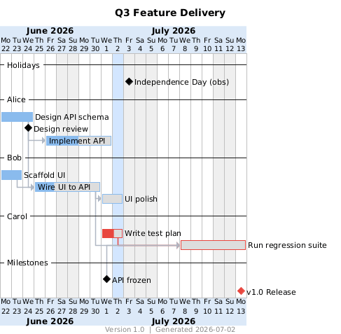
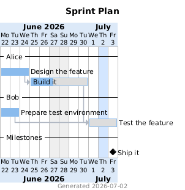

# ganttuml

JSON in, Gantt out. Describe developers and their ordered tasks/milestones in one JSON file →
get a rendered PlantUML Gantt (PNG + SVG). General-purpose; no Jira required (but an optional per-item Jira
link becomes a clickable hyperlink in the SVG).



**New here?** See **[HOWTO.md](HOWTO.md)** for step-by-step recipes (add a person, task, milestone,
PTO, holiday, a working Saturday, Jira links, …). This file is the reference/schema.

## Requirements
- **Python 3.7+** — `ganttuml.py` uses only the standard library (no pip installs).
- **Docker** — only for rendering PNG/SVG via the [`plantuml/plantuml`](https://hub.docker.com/r/plantuml/plantuml)
  image; generating the `.puml` and printing the schedule needs just Python.
- **OS** — `ganttuml.py` runs anywhere Python does (Linux, macOS, Windows). The render scripts
  (`render.sh`, `example*.sh`) are Bash, so rendering via them needs Linux, macOS, or WSL on
  Windows — or run the `docker run … plantuml/plantuml` command from `render.sh` manually.

## Usage
`ganttuml.py` only **generates** the `.puml` (and prints the schedule). Rendering to PNG/SVG is done by the
shell scripts, which run the `plantuml/plantuml` docker directly (ganttuml.py never shells out to docker).
```bash
python3 ganttuml.py --input my.json # validate + write output/<output>.puml + print schedule (no render)
./render.sh my.json                 # generate + render PNG & SVG via the plantuml docker
./example.sh                        # thin wrapper -> render.sh example.json (minimal starter)
./example-advanced.sh               # thin wrapper -> render.sh example-advanced.json (every feature)
```
`render.sh <source.json>` is the reusable generate+render entry point; the per-project `*.sh` files
are one-line wrappers over it. Bare `python3 ganttuml.py` defaults to `--input example.json`.
Output filename comes from `project.output`; artifacts (`.puml`, and `.png`/`.svg`/`.cmapx` once
rendered) go to the **`output/`** subdirectory.

## How scheduling works
- **Developers are lanes.** Each developer's `items` run in the order listed; each task
  **auto-links** after the previous task in that lane (one task at a time).
- **Dependencies** (`depends_on`) add cross-task / cross-developer links by `id`. A task keeps
  BOTH its auto-link and its dependencies — PlantUML starts it after whichever ends latest, so a
  developer is never double-booked.
- **Start floor** (`start`, optional, task-only) is one more lower bound: the task begins on the
  later of its `start` date, its dependencies, and its lane-predecessor (emitted as
  `[id] starts <date>`, which PlantUML max-combines with the `->` arrows). It can hold a task
  but never pull it earlier.
- **Appearance (MS-Project theme).** Bars are a uniform blue (`#8ABBED`); there are **no per-lane
  or per-item colors** (any `color` field is ignored). The **critical path** — the zero-slack chain
  that drives the finish date, computed over `depends_on` **plus** the lane auto-links and start
  floors (resource-constrained) — can be drawn in **red** (`#E8473F`): its bars, milestone diamonds,
  and link arrows. This is **opt-in**: set `project.show_critical: true` (default `false`). When on,
  the schedule report also tags those items `[critical]`. Tune via `project.bar_color` /
  `critical_color` (see Top-level keys).
- **Calendar (all-open model):** weekends (Sat/Sun) and holidays are always non-working. PlantUML's
  calendar is left fully open, so they're emitted as **per-person off-days** (`{dev} is off on
  <date>`) and shaded purely cosmetically with `<date> is colored in` (a visual band that does NOT
  affect scheduling). `requires N days` still counts only that person's open days. This is what lets
  one developer work a normally-closed day:
  - `pto` (per developer) — that person is off those dates.
  - `works_on` (per developer) — that person **works** those normally-closed dates (weekend/holiday);
    nobody else does, and the day stays greyed.
  PlantUML has no per-resource "open" directive, so per-person availability must be modeled this way.
- **PlantUML does all the scheduling.** `ganttuml.py` emits definitions grouped by developer (the
  rows), then every `->` / `happens at` statement in **dependency (topological) order** — so each
  arrow's source is already declared and each milestone's `happens at` snapshots an
  already-positioned target. This is required by PlantUML's evaluation rules (see the
  [PlantUML Gantt docs](https://plantuml.com/gantt-diagram)) and lets a milestone be both a
  dependency and a dependency *source*. `ganttuml.py` also computes the same schedule in Python only to print per-item
  dates + makespan and to flag a milestone landing on a closed day.

## JSON schema
```jsonc
{
  "project": {
    "title": "Q3 Feature Delivery",
    "start": "2026-06-22",            // YYYY-MM-DD
    "output": "example.puml",
    "weekend_color": "#EFEFEF",        // optional; shade for greyed weekend/holiday columns
    "jira_base_url": "https://your-company.atlassian.net",   // optional; for per-item `jira` links
    "holidays": [
      {"date": "2026-07-03", "label": "Independence Day", "show_marker": true},
      {"date": "2026-06-19", "label": "Juneteenth", "enabled": false}  // disabled -> treated as a normal working day
    ]
  },
  "developers": [
    {
      "name": "Alice", "pto": ["2026-06-25"], "works_on": ["2026-06-28"],
      "items": [
        {"type": "task", "id": "api_schema", "name": "Design API schema", "days": 3, "done": 100, "jira": "PROJ-101"},
        {"type": "task", "id": "api_impl", "name": "Implement API", "days": 4, "done": 50},
        {"type": "milestone", "id": "api_done", "name": "API frozen", "depends_on": "api_impl"}
      ]
    }
  ],
  "global_milestones": [
    {"type": "milestone", "id": "release", "name": "v1.0 Release", "depends_on": "qa_run"}
  ]
}
```

### Top-level keys
- **`project`** — `title` (optional centered chart title), `start` (`YYYY-MM-DD` — the only
  required key), `output` (puml filename; a plain name only, always written under `output/`;
  default `example.puml`).
  Optional `version` (free string; shown in a bottom-centre **footer** as `Version <x>  |  Generated
  <today>`, where the date is the generation date — set `show_footer:false` to drop the footer, which
  otherwise always stamps the generation date). Optional `weekend_color`
  (default `#EFEFEF`), `today_color` (default `#4F9BFF40` — a translucent blue band on today; the
  `40` suffix is the alpha/opacity, lower = more transparent), `show_today`
  (default `true`), `undone_color` (default `#DDDDDD` — the fill for the remaining/undone part of a
  `% done` bar; PlantUML hardcodes the bar border to 1px, so visibility comes from this fill, not a
  thicker outline). **Theme** (all optional): `bar_color` (default `#8ABBED` — the uniform MS-Project
  blue for every non-critical bar), `critical_color` (default `#E8473F` — the red for critical-path
  bars/diamonds/links), `arrow_color` (default `#B0B7C3` — non-critical link arrows), `header_color`
  (default `#DCE9F8` — the timeline header band), `show_critical` (default `false` — opt in to the
  red critical-path marking). Plus `jira_base_url`,
  `holidays[]` (each `{date, label, show_marker?, enabled?}`; `enabled:false` → treated as a normal
  working day). Weekends (Sat/Sun) are always non-working.
- **`developers`** — ordered list; each has `name`, optional `pto` (dates this person is
  off), `works_on` (dates this person **works** despite a weekend/holiday), and `items` (tasks +
  milestones, in lane order). Order = top-to-bottom lane order. (A `color` field is accepted but
  **ignored** — bars use the uniform theme; see "Appearance" above.)
- **`global_milestones`** — a **separate, project-level** milestone array, *not* owned by any
  developer (e.g. release gates / roll-ups like "RC1 complete"). Same milestone fields as in-lane
  milestones; they render in the trailing "Milestones" lane with no resource. This is the place for
  a cross-team marker that `depends_on` many tasks across developers.

### Item fields
- **task**: `type:"task"`, `id` (unique), `name`, `days` (>=1), `done` (**required** — integer percent
  0–100; fills that fraction of the bar in the theme color, the remainder is filled with
  `undone_color` — default light gray). Optional: `depends_on` (id or list of ids), `start`
  (`YYYY-MM-DD` — a **floor**: the task starts no earlier than this date, but a later dependency or
  lane-predecessor still wins; task-only — milestones use `on`), `jira` (issue key), `url` (full
  link, overrides `jira`). Bar color is automatic (theme blue, or red if on the critical path); a
  `color` field is ignored.
- **milestone**: `type:"milestone"`, `id`, `name`, and exactly one of: `on` (absolute
  `YYYY-MM-DD`) | `depends_on` (one id or a list — the milestone sits at the **latest end** of
  those items, via repeated `happens at`). Optional `jira`, `url`. Diamonds are black, or red if on
  the critical path (a `color` field is ignored). Milestones may be per-developer (inside `items`)
  or global (`global_milestones`); a `depends_on` milestone renders in a trailing "Milestones" lane
  (no resource).

### Jira / URL links
If an item has `url`, it is used verbatim; else if it has `jira` and `project.jira_base_url` is
set, the link is `{base}/browse/{jira}`. Emitted as `links to [[...]]` → clickable in the SVG
(PlantUML also writes an `.cmapx` image-map for the PNG).

## Validation
`ganttuml.py` fails fast (non-zero exit) on any invalid input — nothing is silently ignored:
an **unknown key at any level** (catches typos like `depends_om`; keys starting with `_` are
treated as comments, e.g. `"_comment": "..."`), a field of the wrong type (e.g. `pto` that isn't
a list, a holiday that isn't an object, a non-string `title`), duplicate ids, unknown or self
`depends_on` ids, cyclic dependencies, unparseable dates, a missing/empty item `name` or
developer `name`, duplicate developer names, a bad `type`, `days < 1`, a task missing `done` or
a `done` that isn't an integer 0–100 (or `done` on a milestone), a milestone that doesn't have
exactly one of `on`/`depends_on`, a `works_on` date that isn't actually a closed day (a no-op is
almost always a typo), a date listed in both `works_on` and `pto`, a non-milestone entry in
`global_milestones`, a duplicate holiday date, a holiday missing `date` (or `show_marker`
without a `label`), a `project.output` that isn't a plain filename, or a calendar so
over-constrained that no working day exists within 10 years. The schedule report also flags any
milestone that lands on a closed day.

## Examples
- **`example.json`** — a minimal starter (two developers, a dependency, a milestone): copy this
  to begin your own chart. Its render:

  

- **`example-advanced.json`** — exercises **every** feature (all but `show_footer: false`):
  both milestone modes (`on` and `depends_on`,
  single and list), `jira` + `url` links (one item carries both — `url` wins), an ignored `color`
  field, PTO, `works_on`, a disabled holiday, a `start` floor, the critical path, and every
  appearance option set explicitly. The chart at the top of this README is its render
  ([docs/example-advanced.png](docs/example-advanced.png)).

## Development
The tool itself has **no runtime dependencies**; the test suite uses pytest (dev-only):
```bash
pip install pytest pytest-cov
pytest                                              # run the tests
pytest --cov=ganttuml --cov-report=term-missing    # with the 100% coverage gate
```
Coverage is enforced at **100%** (configured in `pyproject.toml`, which also holds the
ruff lint settings — line length 100).

**Tested with:** Ubuntu 22.04 LTS, Python 3.10, pytest 8, and
[`plantuml/plantuml:1.2026.6`](https://hub.docker.com/r/plantuml/plantuml/tags) — `render.sh`
pins this image by tag **and digest**, so renders are reproducible. To upgrade or switch to
`latest`, edit the `plantuml_image` variable at the top of `render.sh` (instructions inline).

## Architecture
`ganttuml.py` is a single file organized as a one-way pipeline: **load → validate →
schedule → emit → report**. The parsed JSON flows through it as plain dicts and is never
mutated; each stage is a pure function over that data. `Calendar` — per-person availability
(weekends, holidays, `pto`, `works_on`) — is the one stateful concept and the one class.
The `.puml` is emitted as f-string statements in two phases (definitions, then
dependency-ordered positioning), because PlantUML evaluates its input sequentially: the
emission order itself carries the scheduling semantics. The runtime uses only the Python
standard library.

## License
MIT — see [LICENSE](LICENSE).
